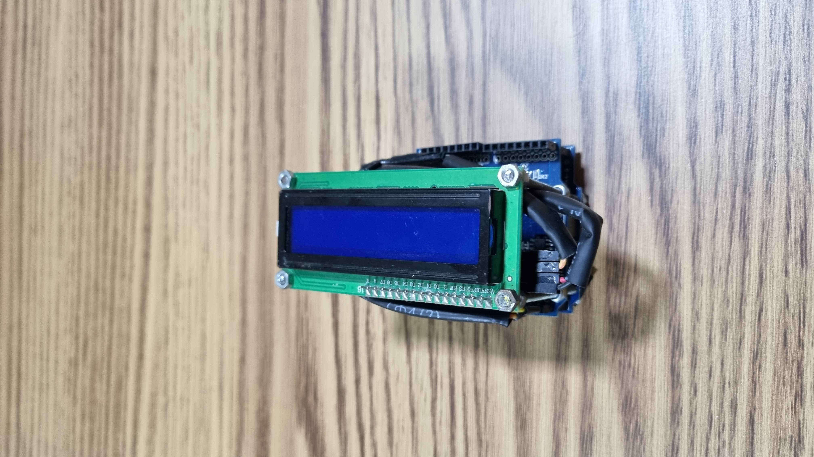

# PROPOSTA DE TRABALHO DE CONCLUSÃO DE CURSO (TCC)

## Assista ao vídeo de demonstração

## PITCH

A segurança e privacidade do usuário na internet têm se tornado temas cada vez mais importantes nos dias atuais. Com o aumento do uso de computadores com acesso à internet e a disponibilização de muitos serviços online, como WhatsApp, Telegram, Messenger, entre outros, o número de computadores infectados por malwares também tem aumentado. Um estudo da Kingsoft de 2016 mostrou que, em média, de 2 a 5 milhões de computadores são infectados por dia.

Embora os comunicadores instantâneos utilizem criptografia entre dispositivos, não é possível garantir que o dispositivo que recebeu ou enviou a mensagem não esteja infectado por um malware. Esses malwares podem capturar a mensagem antes mesmo do usuário pressionar ENTER, por meio do uso de keyloggers ou gravando a tela do usuário para enviá-la a hackers.

A minha proposta busca uma solução para esse problema. Utilizando um Arduino conectado ao computador, podemos criar um middleware entre um teclado externo e o computador para realizar a criptografia de mensagens que realmente precisam ser seguras e privadas.

O Arduino receberia a entrada de dados do usuário por meio do teclado e criptografaria a mensagem antes mesmo de ser digitada no computador. O Arduino também possibilitaria visualizar e alterar a mensagem original por meio de um display conectado a ele.

Na outra extremidade, onde a mensagem é recebida, seria necessário um dispositivo semelhante. Nesse caso, seria utilizado um programa em que a mensagem recebida é colada e enviada para o Arduino realizar a descriptografia da mensagem. A mensagem original seria exibida no display.

## ANOTAÇÕES

- Yubico
- KeyScrambler
- [Teclado sem fio da Microsoft com sistema de criptografia](https://www.techtudo.com.br/noticias/2011/06/novo-teclado-sem-fio-da-microsoft-com-sistema-de-criptografia.ghtml)
- [Review: Teclado Mecânico Wireless Matias Secure Pro](https://forum.adrenaline.com.br/threads/review-teclado-mecanico-wireless-matias-secure-pro.527253/)
- [Keymap ABNT2](https://www.hackeduca.com.br/ligando-um-teclado-ps2-ao-arduino/)
- [Teclas PyAutoGUI](https://pyautogui.readthedocs.io/en/latest/keyboard.html#keyboard-keys)
- [Display LCD I2C](https://github.com/fdebrabander/Arduino-LiquidCrystal-I2C-library)
- [Ícone](https://icon-icons.com/pt/icone/para-os-olhos-oculto-invis%C3%ADvel/111380)

## TO-DO

- [x] Renomear o repositório
- [x] Tornar público
- [x] Refatorar programa em Python
- [x] Criar banner para o repositório do Git
- [x] Permitir rolagem no visor (permitir voltar)
- [x] Selecionar criptografia (rot47)
- [x] Criptografar mensagem no modo "encrypt"
- [x] Descriptografar mensagem no modo "decrypt"
- [ ] Colocar todos os comentários e variáveis em inglês
- [ ] Fazer comandos combinados funcionarem (Ctrl + A)

## Bugs a serem resolvidos

- [x] Troca de modo do programa
- [x] Decrypt não está funcionando
- [x] Ao clicar várias vezes rapidamente, o texto está sendo escrito em vez de executar a ação
- [ ] Remover a limitação de utilização de apenas caracteres ASCII

# Arquitetura do projeto

# Imagem do software do computador

 
 
 

<h1>Imagens do hardware</h1>

 
 
 

<h1>Imagens da utilização</h1>

## Sem o middleware

## Com o middleware

## Sem o middleware

## Com o middleware

## Sem o middleware

## Com o middleware

